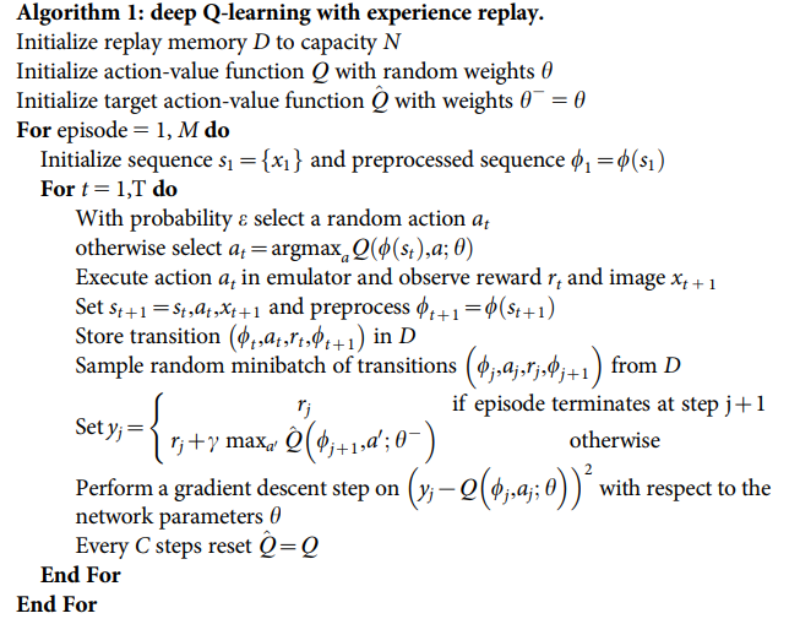
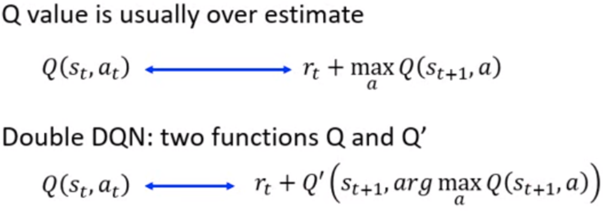
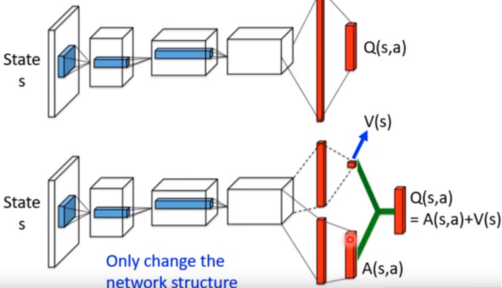
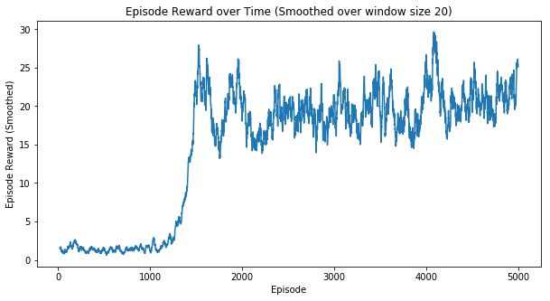
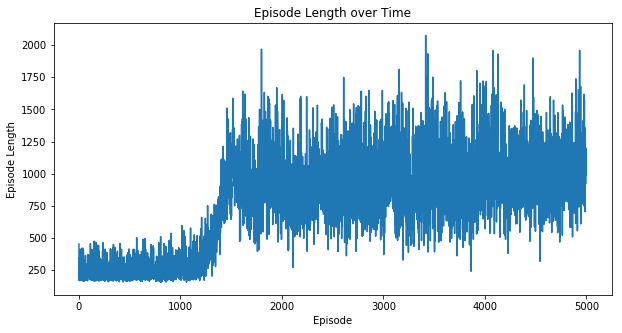
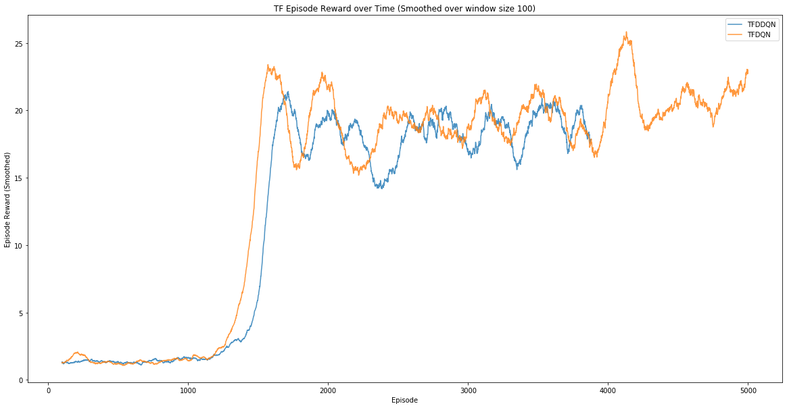
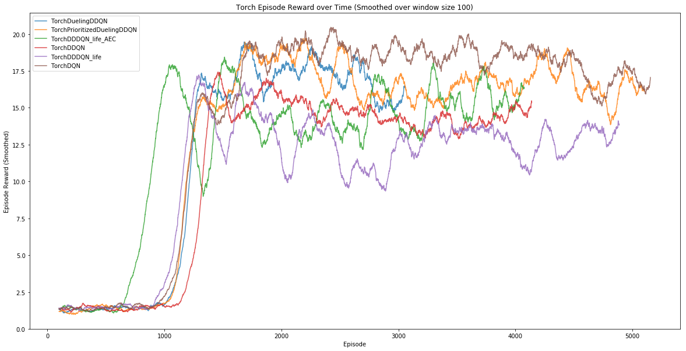

# Reinforcement Learning - Assignment 2

# 1. 方法

本次实验使用DQN打砖块, 实现了以下算法:

**Tensorflow**

* DQN
* Double DQN

**Pytorch**

* DQN
* DoubleDQN
* Dueling Double DQN
* Prioritized Dueling Double DQN
* 还有基于Dueling Double DQN的两个改进:
  * 考虑一个episode内的生命损失
  * 考虑episode内的生命损失时, 使用**Attention增强的卷积网络([github](https://github.com/leaderj1001/Attention-Augmented-Conv2d),[arxiv](https://arxiv.org/abs/1904.09925))**

**代码**

* Tensorflow 实现见 dqn, dqn_double两个py文件
* pytorch实现在PytorchDQN文件夹下
* 画图见ipynb文件

**视频**

* 见da/video文件夹

### 1. 1 DQN

DQN with experience replay

* 使用神经网络近似Q函数
* experience replay 解决时序样本相关性的问题
* target network解决波动过大的问题

### 1.2 Double DQN

* 使用Double learning的想法

* 不用再搞两个网络,经过推导,可以直接改targets:

  

### 1.3 Dueling Double DQN

将Q拆为V和A
$$
Q(s, a ; \theta, \alpha, \beta)=V(s ; \theta, \beta)+\left(A(s, a ; \theta, \alpha)-\frac{1}{|\mathbb{A}|} \sum_{a^{\prime}} A\left(s, a^{\prime} ; \theta, \alpha\right)\right)
$$

### 1.4 Prioritized Dueling Double DQN

* 给经验排序，让好的经验先训练
* Stochastic Prioritization $P(i)=\frac{p_{i}^{\alpha}}{\sum_{k} p_{k}^{\alpha}}$
* 这样会导致采样分布和真实分布不同,需要使用importance sampling weights改进:
  * $\hat w_i = (\frac{1}{N}\frac{1}{P(i)})$
  * normalization: $w_j = \frac{\hat w_i}{\max_i\hat w_i}$
* 计算loss时加上这个权重之后梯度更新
* 工程中使用Sum Tree加速,我实现时使用[github的代码](https://github.com/rlcode/per)

### 1.5 考虑 lose life 

参考github论坛上提高方法,据说将losslife代替游戏结束效果会好,但实际实践中发现并没有,只是稍微提高了收敛速度。

### 1.6 Attention 增强的卷积

**Attention增强的卷积网络([github](https://github.com/leaderj1001/Attention-Augmented-Conv2d),[arxiv](https://arxiv.org/abs/1904.09925))** 使用Self-attention的想法增强卷积的性能，据说效果不错，具体见论文。试验中，将后两层卷积改为Attention Augmented Convolution层，使得收敛步数显著变少（下图对比的绿色线条），但是收敛效果不是很好。

* 试验中是使用了Prioritized Dueling Double DQN + loss life + 卷积增强

## 2. 训练曲线对比

TF版本的DQN基本实现的reward曲线 和 length 曲线:

Tensorflow 的训练结果对比:

Pytorch的训练结果对比:

## 3. 最大得分

由于训练长度不一样,所以最大得分直接对比不公平, 以下为得分表, 对应视频见文件夹'da/video':

| 方法                              | 最高分 |
| --------------------------------- | ------ |
| TF_DQN                            | 49     |
| TF_DoubleDQN                      | 41     |
| Torch_DQN                         | 67     |
| Torch_DoubleDQN                   | 47     |
| Torch_DuelingDoubleDQN            | 51     |
| Torch_PrioritizedDuelingDoubleDQN | 60     |
| Torch_DuelingDoubleDQN_life       | 34     |
| Torch_DuelingDoubleDQN_life_AEC   | 39     |

## 4. 结论

* 由于机器性能的性质，对比原论文的方法，最大记忆长度减少为20w, $\epsilon$-greedy 的衰减步数也减少为20w， 加之训练帧数只有1m左右，远少于论文中的几十million帧，从而结果并没有达到几百的得分， 甚至未能有人类水平。
* 训练曲线和最高得分表中，反而是最原始的DQN效果最好，Doubled的 性能不行。这与原论文中breakout在加了DQN之后效果反而下降的结论是相同的。但加上Dueling或prioritized之后性能差不多追上来了。
* life loss 替换游戏结束的done加入模型中会使得收敛变快，但最终得分不高，加入Attention增强的卷积之后收敛明显变快，但是得分不尽如人意。
* 可能上述原因和参数 配置有很大关系，但受计算资源限制，无法做fine tuning，Attention层的加速效果不知是模型变复杂带来的还是Attention适合这类问题（直觉上应该给小球更大得到关注量）还是偶然情况，后面有时间细看。

