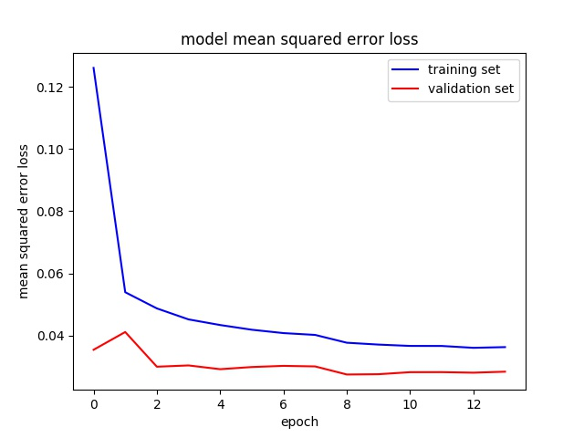

# Reinforcement Learning - Assignment 3

This is a toy example of behavior cloning.

One need data and simulator to run this code. see Udacity self-driving simulator for more info.

```
_________________________________________________________________
Layer (type)                 Output Shape              Param #   
=================================================================
cropping2d_1 (Cropping2D)    (None, 65, 320, 3)        0         
_________________________________________________________________
lambda_1 (Lambda)            (None, 65, 320, 3)        0         
_________________________________________________________________
conv2d_1 (Conv2D)            (None, 31, 158, 24)       1800      
_________________________________________________________________
batch_normalization_1 (Batch (None, 31, 158, 24)       96        
_________________________________________________________________
conv2d_2 (Conv2D)            (None, 14, 77, 36)        21600     
_________________________________________________________________
batch_normalization_2 (Batch (None, 14, 77, 36)        144       
_________________________________________________________________
conv2d_3 (Conv2D)            (None, 5, 37, 48)         43200     
_________________________________________________________________
batch_normalization_3 (Batch (None, 5, 37, 48)         192       
_________________________________________________________________
conv2d_4 (Conv2D)            (None, 3, 35, 64)         27648     
_________________________________________________________________
batch_normalization_4 (Batch (None, 3, 35, 64)         256       
_________________________________________________________________
conv2d_5 (Conv2D)            (None, 1, 33, 64)         36864     
_________________________________________________________________
flatten_1 (Flatten)          (None, 2112)              0         
_________________________________________________________________
batch_normalization_5 (Batch (None, 2112)              8448      
_________________________________________________________________
dense_1 (Dense)              (None, 128)               270336    
_________________________________________________________________
dropout_1 (Dropout)          (None, 128)               0         
_________________________________________________________________
batch_normalization_6 (Batch (None, 128)               512       
_________________________________________________________________
dense_2 (Dense)              (None, 64)                8192      
_________________________________________________________________
dense_3 (Dense)              (None, 10)                650       
_________________________________________________________________
dense_4 (Dense)              (None, 1)                 11        
=================================================================
Total params: 419,949
Trainable params: 415,125
Non-trainable params: 4,824
_________________________________________________________________
```




1. **测试集上的loss为：0.028371946830205965**

2. 最后的模型可以在自动驾驶第一个场景中跑完整圈，run1.mp4 是跑了**2圈多**之后被手工关闭的结果


**改进**：

* 注意到图片处理中给所有validation集和训练集加上了高斯模糊和增量，这和测试场景不符合，所以加上了随机数，以1/2的概率进行上述处理，这样既可以使用原数据，又可以使用则增强数据
* 将YUV空间训练改为RGB空间，这和模拟环境的测试图片颜色空间一致，改变之后，效果有质的飞跃。
* 将速度改为了30，可以缩短测试时间。

