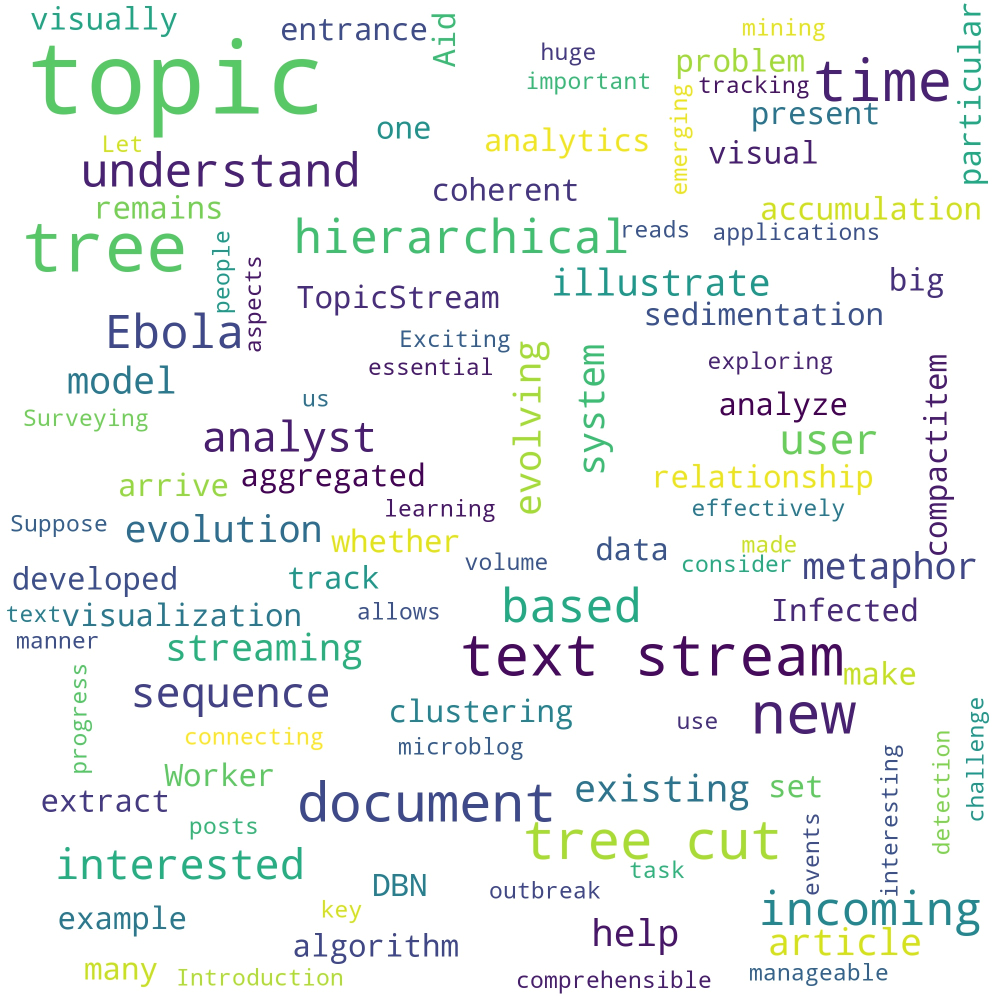

# Assignment 2 - Text Visualization

Treat https://arxiv.org/pdf/1512.04042.pdf as a corpus, and each subsection as a document.

**Object:**
* Text Analysis
  * Tokenization
  * Implement TF Model and TF-IDF Model
  * Report K-D vector
    * The k mostly occurred words in a document
    * The k most significant words (TF-IDF) in a document 
* World Cloud
  * Choose a section and plot its word cloud.
  * Do something about layout and encoding

## 1. Text Analysis

### 1.1 Preparation

Since it is very difficult to load fine text from the pdf file and we can download original tex file from arxiv.org, I use the tex file as inputs. 

First, I read the whole file tree according to the main tex file. Since those texts are in original tex format, I need to do the following precess to get needed text:
* Extract section text from latex codes,
* Remove formulas, graphs, tables and other latex syntaxes,
* Use 'detex' function to get get rid of some fancy styles such as '\textbf'.
  

Then, after we get the corpus, we need to build dictionary from tokenized texts. Therefore, another several text cleaning technologies are needed:
* Remove useless punctuations,
* Turn the words into lower case,
* Remove stop words, 
* lemmatize words
* Tokenize words.

After those operation, we get the formated text data from the corpus.

### 1.2 TF Model and TF-IDF Model

**Some basic ideas**
* Term Frequency ($TF$) is normalized counts with the total number of words, that is, $TF$ socre of a word in a passage is $word \ count / total \ words$ in the passage(not corpus).
* $TF-IDF$ (inverse document frequency) reflects how important a word is to a document in a collection or corpus.
  * $\text{TF-IDF}(w) = \text{TF}(w)\times\log(\frac{|D|}{|D_w|})$
  * $|D|$ is the total number of passage in the corpus
  * $|D_w| is number of passage that contain word $w$ in the corpus
  * $TF-IDF$ can be used to extract key words.

According to aforementioned ideas, I implemented  TF Model and TF-IDF Model in python. Mainly relevant code is bellow:

```Python
def word_count(words):    
    res = {}
    for w in words:
        if w in res:
            res[w] = res[w] + 1
        else:
            res[w] =1
    return(res)

class corpus():
    def __init__(self,corpus):
        self.corpus = corpus
        self.passage_dic = [word_count(t) for t in self.corpus]
        self.n_words = [len(t) for t in self.passage_dic]
        self.n_passage = len(self.corpus)
        self.D_W_info = self.constructure_dictionary()
    
    def constructure_dictionary(self):
        res = defaultdict(set)
        for i in range(self.n_passage):
            for k in self.passage_dic[i].keys():
                res[k].add(i)
        return res
    
    def TF(self,w, passage_id):
        if w in self.corpus[passage_id]:
            return self.passage_dic[passage_id][w] / self.n_words[passage_id]
        else:
            print(w + ' not in the passage!')
            return None
         
    def TF_IDF(self,w,passage_id):
        return self.TF(w,passage_id) * np.log(self.n_passage / len(self.D_W_info[w]))
       
    def get_k_key_words(self,k,passage_id,criterion):
        words = list(self.passage_dic[passage_id].keys())
        if criterion == 'TF':
            score = [self.passage_dic[passage_id][w] for w in words]
        elif criterion == 'TF-IDF':
            score = [self.TF_IDF(w,passage_id) for w in words]
        else:
            print('criterion must be TF or  TF-IDF!')
            return None
        # index of top k in score
        top_id = np.argsort(score)[-k:]
        return [words[i] for i in top_id]
```

### 1.3 Reported K-D vector

The The k mostly occurred words and k most significant words (TF-IDF) in each section is listed bellow(For simplicity, k is 5 here):

|name|TF|TF-IDF|
|---|---|---|
| abstract | representative,hierarchical,cut,tree,topic | behind,helping,generally,able,favorable |
| introduction | document,stream,text,tree,topic | s/he,remains,analyst,ebola,interested |
| related | evolving,method,time,tree,topic | event,proposed,recently,corpus,method |
| system | document,streaming,topic,cut,tree | algorithm,input,arrived,newly,module |
| TreeCut | set,node,topic,cut,tree | predictive,multinomial,node,distribution,probability |
| visualization | time,bar,token,topic,document | stripe,circle,region,token,bar |
| quantative | topic,smoothness,algorithm,cut,tree | running,proposed,measure,baseline,experiment |
| evaluation | case,news,public,ebola,topic | cliff,patient,tax,public,ebola |
| conclusion | hierarchical,user,system,topic,tree | requirement,hierarchical,user,system,future |
| acknowledge | 2015baf23b03,fy15-res-opp-112,china,national,research | fund,fy15-res-opp-112,research,china,national |


## 2 Word Cloud

"wordcloud" package in Python is popular if we want to  create Word Cloud with Python. Therefore , use this in experiments.  Trivially use "generate from text" and theme of wordcloud can generate unpleasing results, since the color is confusing and layout is boring. Plus, I want the aforementioned TF and TF-IDF score can be used to plot the wordle.



Therefore, I used a picture of a dog as a mask to make the layout be the shape of a dog.


Considering the unpleasing color, it will be interesting to adjust the color to match the dog.


I also plot a wordle based on TF-IDF socre.


The mainly relevant code is shown bellow:

```python
from wordcloud import WordCloud, ImageColorGenerator
wc = WordCloud(
        background_color='white',
        max_words=100,
        max_font_size=200,
        random_state=42,
        width=2000, height=2000,
)
def ShowAndSave(pic,name):
    figure(num=None, figsize=(3, 3), dpi=300, facecolor='w', edgecolor='k')
    plt.imshow(pic)
    plt.axis("off")
    plt.show()
    pic = np.array(pic)
    plt.imsave( 'res/' + name + '.jpg',pic)
passage_id = 1 #use Introduction to plot wordcloud

ShowAndSave(wc.generate_from_text(final[2][1]), 'plain')

from PIL import Image
#  dog shape
mask = np.array(Image.open('data/mask.png'))
wc_fancy = WordCloud(
       background_color="white", max_words=1000, mask=mask,
               max_font_size=90, random_state=42
)
w = wc_fancy.generate_from_frequencies(c.passage_dic[passage_id])
ShowAndSave(pic = w, name = 'Frequent')
# recolor
wc_fancy.generate_from_frequencies(c.passage_dic[passage_id])
image_colors = ImageColorGenerator(mask)
w = wc_fancy.recolor(color_func=image_colors)
ShowAndSave(w,'colorAsMask')
# TF-IDF based wordle
words = c.passage_dic[passage_id].keys()
score = {}
for w in words:
    score[w] = c.TF_IDF(w,passage_id)
wc_fancy.generate_from_frequencies(score)
image_colors = ImageColorGenerator(mask)
w = wc_fancy.recolor(color_func=image_colors)
ShowAndSave(w, 'TF_IDF')
```


I also did a little improvement based on the embedding vector of each word, where I  cluster the words into two(toy implementation of the idea) groups and draw wordles in two different parts of the mask.  But since the passage is not interesting and implementation is too naive, result is not that impressive.


However, we can see that 'visualization', 'interactive' are close and 'understand', 'manageable' are close. This is kind of a improvement, I think.

Mainly relevant code is:

```python
# load pre-trained glove model
from gensim.models import KeyedVectors
from gensim.scripts.glove2word2vec import glove2word2vec

glove_input_file = '/home/lzlzlizi/Documents/data/word2vecModel/glove.840B.300d.txt'
word2vec_output_file = '/home/lzlzlizi/Documents/data/word2vecModel/glove.840B.300d.word2vec.txt'
(count, dimensions) = glove2word2vec(glove_input_file, word2vec_output_file)
print(count, '\n', dimensions)
glove_model = KeyedVectors.load_word2vec_format(word2vec_output_file, binary=False)

vecs = {}
word2id = {}
ww = list(c.passage_dic[passage_id].keys())
score = [c.passage_dic[passage_id][w] for w in ww]
words = [ww[t] for t in np.argsort(score)]
i = 0
tt = len(words) - 1
while  i < 150:
    w = words[tt]
    if w in glove_model:
        vecs[w] = glove_model[w]
        word2id[w] = i
        i += 1
    tt -= 1
words = list(vecs.keys())
for w in word2id:
    words[word2id[w]] = w
vecs = np.array([vecs[w] for w in words])
score = np.array([score[word2id[w]] for w in words])

from sklearn.cluster import SpectralClustering 
spectral_model_rbf = SpectralClustering(n_clusters = 2, affinity = 'nearest_neighbors') 
labels_rbf = spectral_model_rbf.fit_predict(vecs) 

cut = sum(labels_rbf)/len(labels_rbf)
h,w,_ = mask.shape
a = np.copy(mask[:,:,3])
a[a!=0] = 1
t = a.sum(axis = 0)
total = sum(t) * cut
tt = 0
for i in range(h):
    if tt < total:
        tt += t[i]
    else:
        break
h1 = i
mask1 = mask[:h1,:,:]
mask2 = mask[h1:,:,:]
d1 = {}
d0 = {}
for w in words:
    if labels_rbf[word2id[w]] == 1:
        d1[w] = score[word2id[w]]
    else:
        d0[w] = score[word2id[w]]
wc_fancy1 = WordCloud(
       background_color="white", max_words=1000, mask=mask1,
               max_font_size=90, random_state=42
)
wc_fancy2 = WordCloud(
       background_color="white", max_words=1000, mask=mask2,
               max_font_size=90, random_state=42
)
w1 = wc_fancy1.generate_from_frequencies(d1)
image_colors = ImageColorGenerator(mask1)
w1.recolor(color_func=image_colors)
w2 = wc_fancy2.generate_from_frequencies(d0)
image_colors = ImageColorGenerator(mask2)
w2.recolor(color_func=image_colors)

ShowAndSave(np.r_[np.array(w1),np.array(w2)],'EmbeddingClustering')
```

