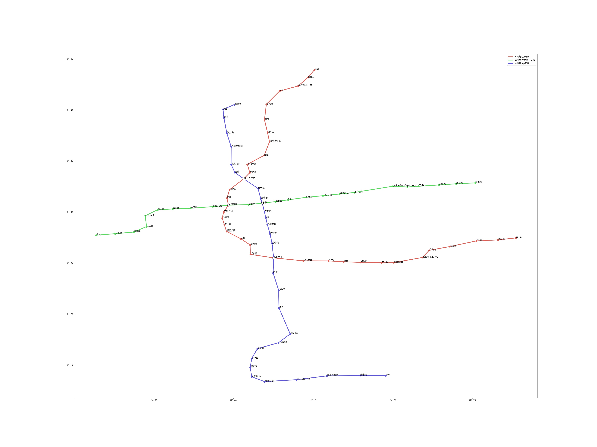
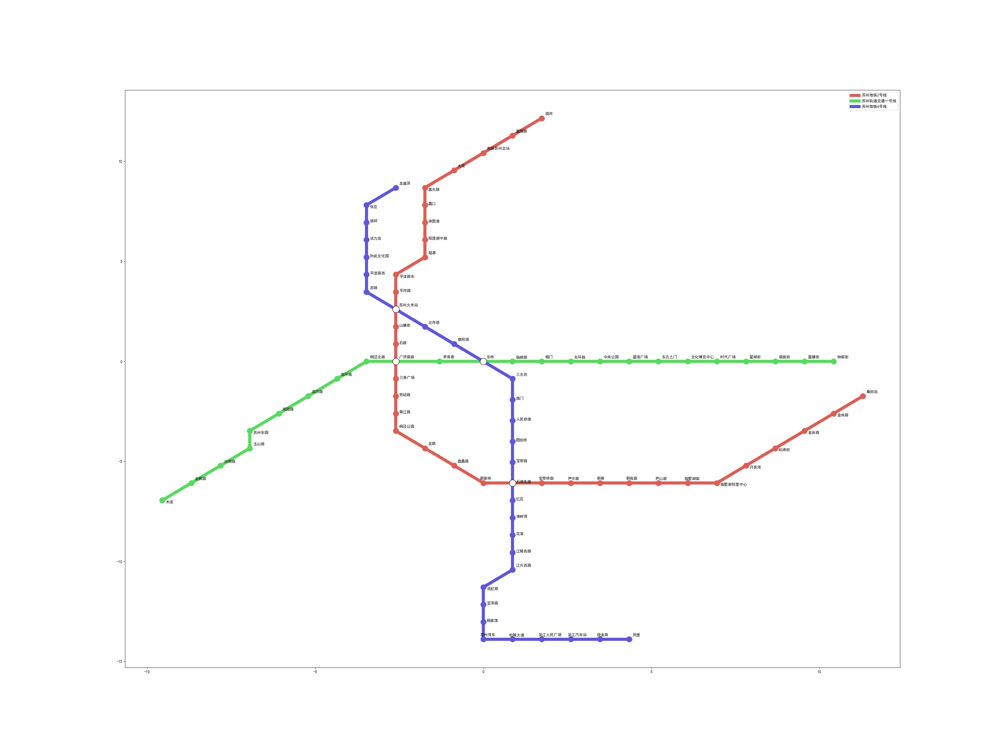
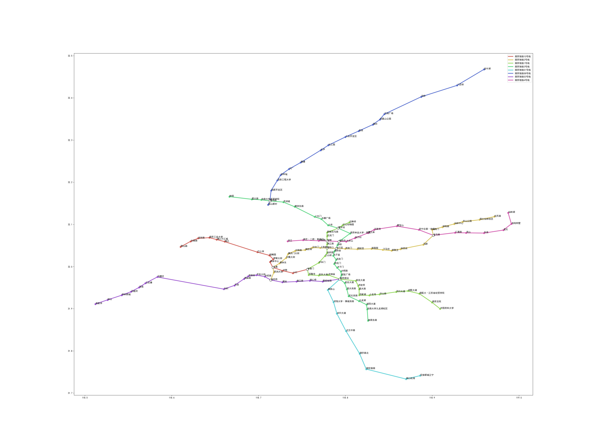
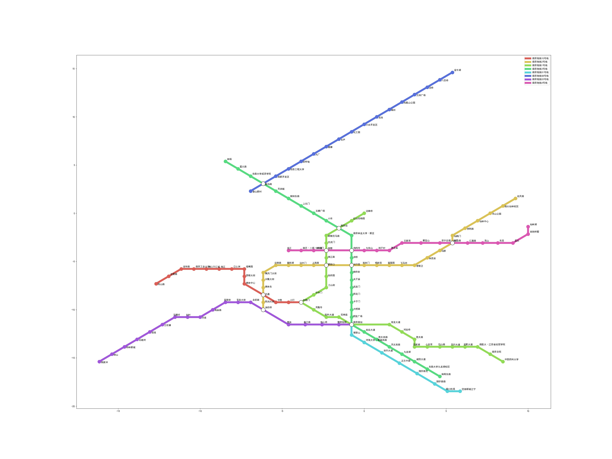

# Metro map

This is the solution to the first assignment of Visualization class.
To run this code, one need to clone the code from [transit-map](https://github.com/juliuste/transit-map) and set up the dependencies.


## 问题描述

实现某个大的城市的地铁图的绘制，采用相关可视化的规则，使得地铁图简洁明了，易懂，颜色搭配合适。

本次实验借助overpass-api提供的API接口，采集苏州和南京的地铁数据，使用transit-map提供的MIP描述，求解，解析结果的代码进行相关优化，并使用python进行作图。实验的代码具有很强的可拓展性，只需提供某城市四个经纬度数据（长方形区域），即可自动完成上述步骤，得到结果。详细步骤和结果如下。


## 求解步骤

### 获取数据

overpass-api提供的API接口:

```
http://overpass-api.de/api/interpreter?data=[out:json];(relation(31.87108155373452,118.55800141308592, 32.21332031534233,118.91505707714842)[%22route%22=%22subway%22];%3E;);out;
```

其中四个数值为对应城市的经纬度范围数据，利用python的request.get()函数爬取数据，得到一个字典变量。

### 清洗，结构化数据

上述的变量含有节点信息，线路信息，但有许多冗余变量，我们需要把数据整理为transit-map的输入格式，是一个包含三个部分的关键变量。

* 节点信息：id、坐标（直接带入经纬度即可）、名称
* 线路信息：线路名称、颜色（不太好看，并且有些城市没有颜色数据，下面会重新设计）
* 边的信息（每一小段路线）：出发节点id、到达节点id、所属线路（可能存在多条）

将原始数据清理为上述数据有一下问题：

* 原始数据的站台是冗余的，大概是因为每个出口或者不同方向不同线路的站台被当做不同的站台，所以有很多节点，有着稍微不同的差别和位置，我们需要把他们合并。（基于站台名）
* 线路会由于方向的不同有多个信息，但我们作图要的是无向图的信息，所以要加以筛选，并且统一方向。（基于部分线路名）
* 有些站台是同一个，但是由于名称不同（api后台数据质量不行），不能被轻易识别，我们需要人工识别出这些不同（比如南京南，南京南站是同一个）。
* 不同线路有时会进过相同的路线，此时上述第二条处理时可能会出现方向不同导致后续无法优化的问题，我们要在程序中作适当记录，加以调整。

### 使用transit-map优化

[transit-map](https://github.com/juliuste/transit-map)是github上的一个开源框架，但还没有完成，属于[*Generating Transit Maps*](https://github.com/public-transport/generating-transit-maps) 项目的一部分。该项目使用JavaScript将问题描述为一个标准MIP问题，并使用[Gurobi](https://www.gurobi.com/) 进行优化，得到优化结果后再利用JavaScript处理，作图。但是由于该项目未完全做完，得到的地铁图没有label，也并不能按宣称的返会json数据。但幸运的是结果图SVG文件可以当做xml解析，并使用python进行进一步处理。

主要的目标和约束如下：

* 硬约束：
  * 拓扑结构一致（节点顺序，连接关系与原图一致）
  * 边的长度在一定的范围内
  * 不相邻的边保持最小间距
  * 边的方向只能为八个（正方向加45度斜方向）
* 软约束
  * 折线尽量少
  * 边的长度尽量小
  * 相邻位置尽量保持

环境配置完成后直接按下列命令即可运行。

```
cat graph.json | transit-map > output.svg -t t/
```

这部分操作被整合到了python脚本中，可以自动实现。

### 画图

#### 颜色配置

由于原来颜色不好看以及有些城市缺失颜色数据，这里采用python中color_palette调色盘函数采集数据，大概想法是有几条地铁线就采几个颜色，这些颜色均匀地分布在调色盘上（相当于一个圆盘被等分成n份，切点即为我们的颜色），这样对比最明显。得到颜色后随机赋值给不同的线路。

### 站台的画法

有些站台是换乘站，有很多路线经过，我们将其画大，并且使用黑框白心点来表示，其他节点为实心圆点，颜色和路线颜色一致。

#### 站点名称的绘制

我们将站台名放在节点的右上方，处理之前的地铁图弯弯曲曲无法处理站台名。 但是处理之后的地铁图只有斜向上四十五度角的路线会遮挡站台名，我们将这部分站台名画在节点右下方（部分特殊情况可能会有重叠，不在此次实验讨论之内）。

#### 最后画图简介

使用python的matplotlib包按上上述规则绘制。但是，由于metro-map结果是xml格式的svg，我们需要读取其中的节点坐标信息并结合原始数据进行作图。（其中部分节点部分坐标缺失，经过实验，缺失部分值为0，补上即可）。


## 结果

本次实验以苏州和南京为例，原始图和我们处理完之后的图展示如下（建议直接打开result文件夹浏览）：

苏州原始地铁图



苏州地铁图结果



南京原始地铁图



南京地铁图结果



